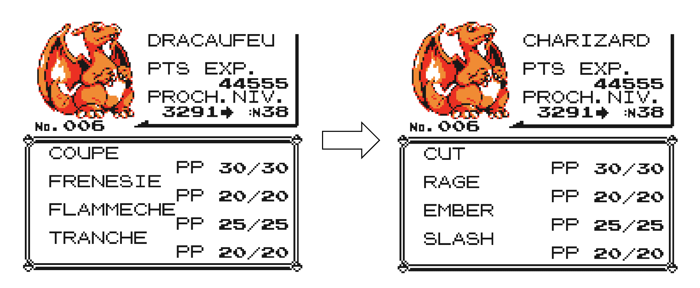

# PokeTranslate



Welcome on PokeTranslate**! This software automatically translates into any language parts of Pokemon ROMs. Currently, Pokemon names, moves (TM/HM) are supported.

> 💡 Disclaimer: The software is still under development. Alpha versions are provided for testing purposes, please report any bug you may find.
>

# Installation

---

You need Python to run this program. It can be installed easily using Pip:

```bash
pip install poketranslate
```

# How to use

---

After having installed PokeTranslate in a Python environment, you can run it by command line:

```bash
poketranslate --rom rom.gbc --pokemons pkm_list_gen_4_eng_fra.xlsx --moves pkm_list_moves_eng_fra.xlsx --tbl pkm_crystal.tbl
```